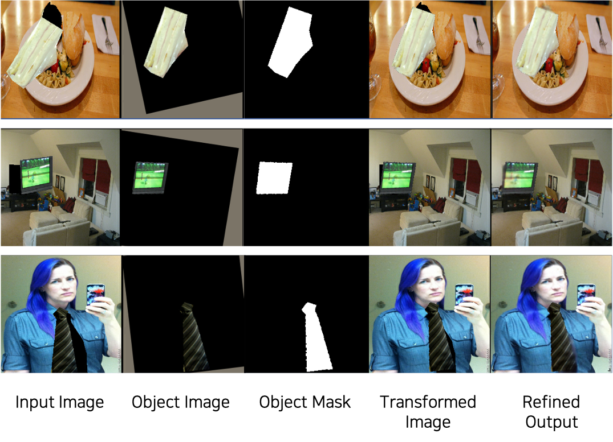
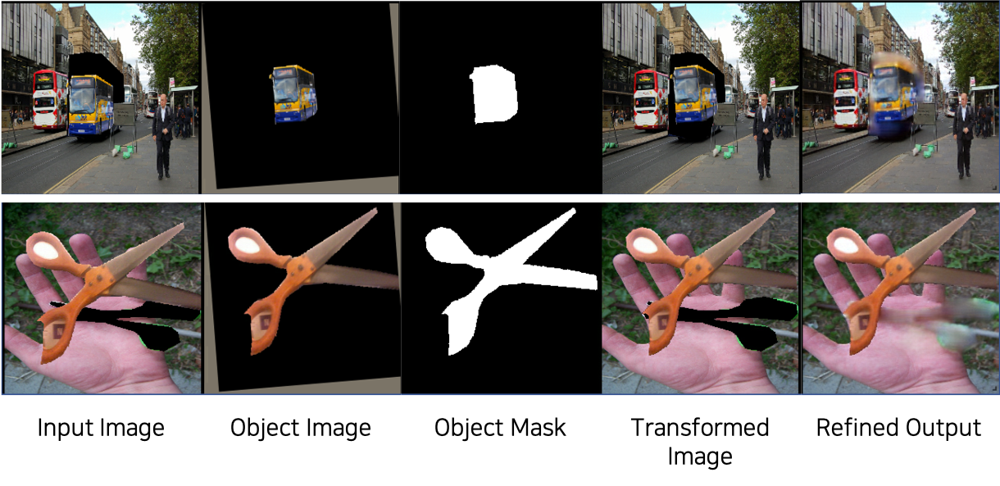
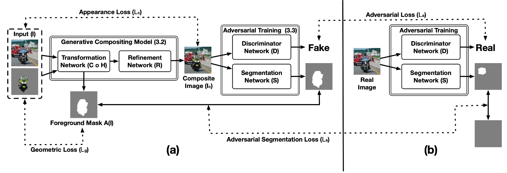
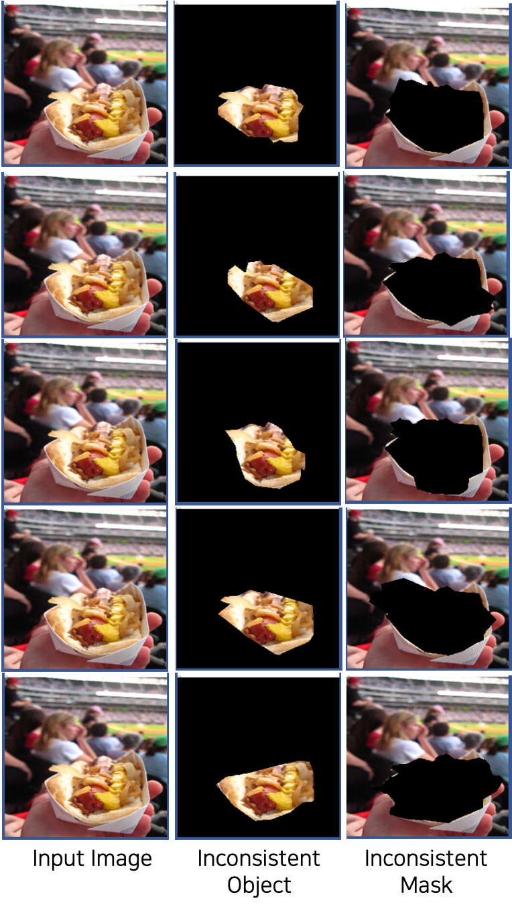
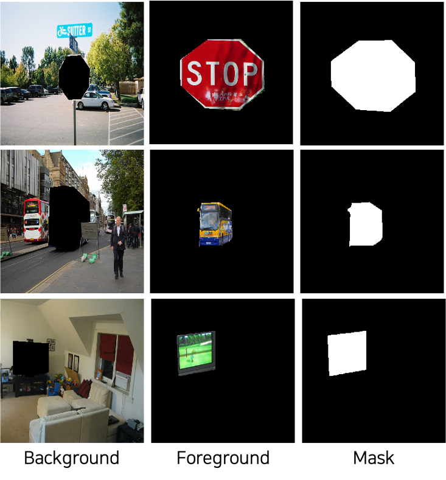

# Toward Realistic Image Compositing with Adversarial Learning (CVPR 2019)

Unofficial implementation of "Toward Realistic Image Compositing with Adversarial Learning (CVPR 2019)" in PyTorch.

## Example Results
</img>
### Failure Cases
</img>

## Networks
</img>

## Dataset Preparation
First of all, download [MS-COCO(train2014)](http://images.cocodataset.org/zips/train2014.zip)

### Data Pre-Processing
I followed the dataset generation process as described in the original paper.

Download validAnns_train.pkl, validAnns_dict_train.pkl, top5_dict_train.pkl, validAnns_val.pkl, validAnns_dict_val.pkl, and top5_dict_val.pkl (skipping procedure from 1 to 3).

When the phase is `train`,

~~1. "generate_valid_anns.ipynb": to filter out small objects and generate validAnns_train.pkl~~

~~2. "list-to-dict.ipynb": to generate validAnns_dict_train.pkl using validAnns_train.pkl~~

~~3. "top5-gcc-n0000.ipynb": to compare IoU between objects within the same category and pick top 5 items~~

4. "mask-operation.ipynb": to save five different triplet images for a single object with validAnns_train.pkl and top5_dict_train.pkl

This procedures generate 678,685 training triplets(from 75,737 COCO objects). The total images hold 173G, so I won't upload them.

### Training Dataset Examples
</img>

When the phase is `test`,

1. "test-dataset-generation-top5-bg.ipynb": to save testing triplet images with validAnns_val.pkl and top5_dict_val.pkl

Testing images contain 363 triplets, and you can download them (52M) [here.](https://drive.google.com/file/d/15HvihsCQ7flo39HIZn5zj2BJJDmkC-cj/view?usp=sharing)

### Testing Dataset Examples
</img>

## Getting Started
### Installation
Clone this repo:
```bash
git clone https://github.com/SuhyeonHa/GCC-GANs
cd GCC-GANs
```

<!-- ### Pre-trained Model
### Prerequisites (to be updated)
- Python 3.7
- Pytorch 0.4.1
...
-->

### Before Training
Please make sure all directories are set right.
```python
ann_dir = '/data/COCOdataset2017', # COCO dataset
data_dir = '/GCCdataset/alltypes', # GCC-GANs dataset
save_model_dir = '/GCC-GANs/models/', # Saving folder
```

<!-- ### Pre-trained Model
#### Generator
Download [here](https://drive.google.com/file/d/1lYMQPggOOIulBDrMZHOFkipUiJ_Utw5F/view?usp=sharing)

This model isn't the best model.
-->
